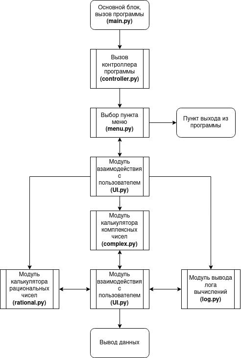
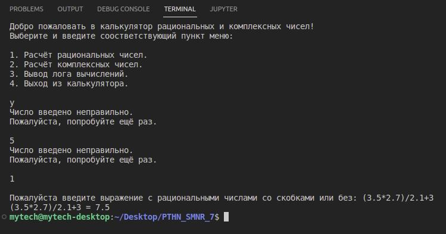
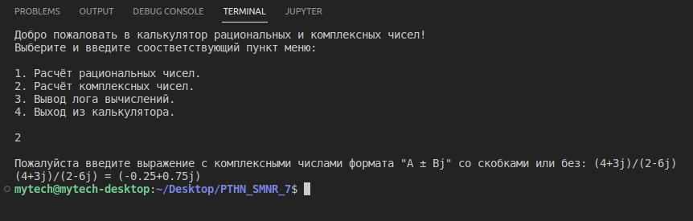
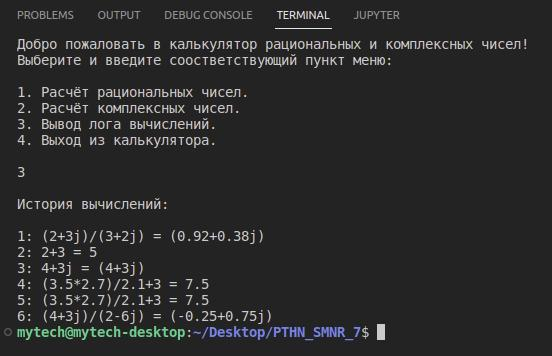
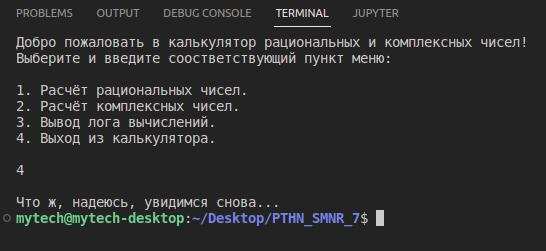

# **Программа для расчёта рациональных или комплексных чисел с возможностью сохранения лога**
## **Архитектура программы:**


Программа работает по модульному принципу, где из одного модуля вытекает другой, а иногда происходит взаимодействие модулей для вывода информации пользователю на экран (модуль **UI.py**)
## **Описание работы программы:**
1. При запуске программы пользователю необходимо выбрать пункт меню, соответствующий его описанию:

.jpg)

2. При выборе, например, вычисления рациональных чисел, пользователю необходимо ввести выражение, которое он желает вычислить:


```
P.S.: При вводе неверных значений в любом из модулей программа выдаст предупреждение.
```
3. При выборе, например, вычисления комплексных чисел, пользователю необходимо ввести выражение, которое он желает вычислить:



4. Программа может выводить лог, в котором хранятся ранее вычисленные пользователем выражения:



```
P.S.: В случае с пустым журналом программа выдаст соответствующее предупреждение.
```
5. Также можно выйти из программы, введя 4 пункт меню:



**Над приложением работал Кириллов Кирилл.**